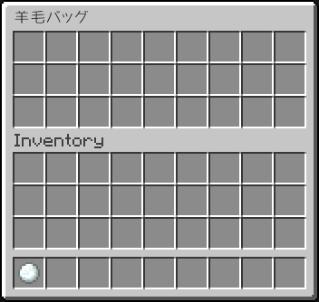
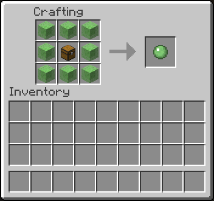

Satchels 
===

アイテムを入れられるSatchels（カバン）を追加するプラグインです。

使い方
---

- クラフト後、ホットバーから右クリックで使用できます。
- Satchelsに入れてアイテムをまとめて他のプレイヤーに渡すことも可能です。
- Satchelsの中にカバンを入れることはできません。

レシピ
---

#### 木の小物入れ

- 木の棒 x8
- チェスト

#### 革の小物入れ

- 革 x8
- チェスト

#### 羊毛バッグ

- 羊毛 x8
- チェスト

#### スライムバッグ

- スライムブロック x8
- チェスト

#### エンダーバッグ

- エンダーチェスト x8
- チェスト

